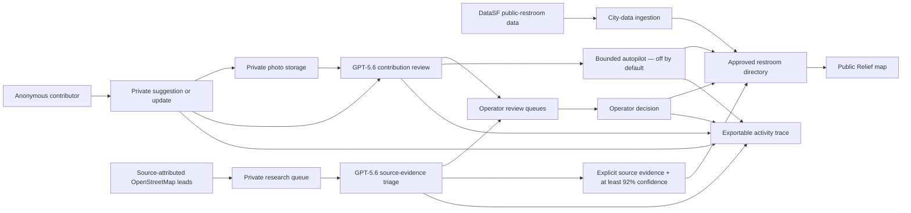

# Relief — San Francisco restroom finder

Relief helps someone find a usable restroom before it becomes an emergency. It is a browser-first, mobile-friendly map that combines official San Francisco restroom data, approved community contributions, and an AI-assisted research pipeline.

## Try Relief

- Consumer and contributor experience: [https://relief-sf.vercel.app](https://relief-sf.vercel.app)
- Operator experience: [https://relief-sf.vercel.app/operator](https://relief-sf.vercel.app/operator) using the credentials in the Devpost testing instructions
- No consumer account or local build is required

## User flows

### Consumer and contributor

A consumer can search known restrooms, parks, neighborhoods, and businesses; use **I'M FEELING LUCKY** to find the physically closest option; filter the map; inspect photos, descriptions, access information, and tags; and open directions.

Relief also lets someone update an existing restroom or suggest a missing business without knowing its address. Mapbox place discovery supplies the location, while the contributor can add access attributes, a cleanliness rating, notes, and a restroom-only photo. The submission remains private while it is reviewed.

### Operator

The public map is backed by an operator workspace for reviewing community evidence and scaling coverage. An operator can inspect the private image, GPT confidence and reasoning, supported facts, proposed changes, concerns, source evidence, and the exportable activity trace before making a decision.

| Queue | Operator job to be done | How GPT-5.6 contributes |
| --- | --- | --- |
| Needs Judgment | Resolve ambiguous evidence and approve, reject, or amend and re-run | Identifies uncertainty or concerns and explains why human judgment is required |
| GPT Approved | Inspect safe recommendations eligible for human publication | Reviews the photo and submission, then proposes supported facts, tags, description, confidence, and a publication outcome |
| Operator Approved | Audit records deliberately approved and published by the operator | Retains its earlier recommendation and reasoning in the trace; the operator owns the final decision |
| Rejected | Inspect unsafe, irrelevant, or unsupported evidence retained for audit | Detects non-restroom images, unsafe content, or unsupported claims and records the rejection reason |
| Research Leads | Process source-attributed leads and follow the proposed publication, research, judgment, or rejection route | Evaluates retained source evidence and routes each lead to publication, evidence collection, human judgment, or rejection |

Approving a photo-backed suggestion or update publishes the approved restroom photo with the public record. Pending and rejected evidence remains private.

## Built with Codex and GPT-5.6

As a former product manager, I acted as Relief's product owner. I defined the problem, the consumer, contributor, and operator journeys, and the evidence policy behind publication. I decided that the public experience should require no account, that submissions should remain private by default, and that the system must never infer access policy, door codes, hours, accessibility compliance, or restroom availability from a generic venue category.

Codex was my multidisciplinary implementation partner throughout Build Week. It accelerated research, first-pass interface design, architecture, engineering, and debugging, while I set direction, approved tradeoffs, tested the product, and retained final responsibility for what shipped. GPT-5.6 is different: it runs inside the product in bounded, server-side workflows.

| Workstream | What I owned | What Codex owned and accelerated | What GPT-5.6 unlocked |
| --- | --- | --- | --- |
| Product strategy | The urgent-use problem, target users, browser-first scope, no-account experience, and success criteria | Converted the three user journeys into implementable flows | — |
| Publication policy | Evidence boundaries, confidence gates, prohibited inferences, and final acceptance criteria | Implemented Supabase states, access controls, provenance, autopilot constraints, and the activity trace | Structured review of submitted evidence and bounded routing recommendations |
| Product design | Mobile-first outcomes, information hierarchy, review ergonomics, and final design decisions | Produced and refined the first-pass UI, responsive behavior, and accessibility details | Evidence-backed descriptions and supported tag proposals |
| Architecture and engineering | Product requirements, risk decisions, stack approval, and what was ready to ship | Researched options and implemented Expo, Supabase, Vercel, Mapbox, ingestion, and operator tooling | Multimodal photo assessment and structured research-lead classification |
| Quality and reliability | Acceptance testing, demo readiness, and judgment on edge cases | Diagnosed and fixed submission, approval-state, map-sync, deployment, and error-handling issues | — |
| Responsible scale | The requirement to preserve uncertainty and provenance while expanding coverage | Built the private research queue, batch controls, explicit routes, and auditability | Triage of source-attributed leads without turning generic venues into restroom claims |

“Owned” describes the division of work during the build; I retained authorship, product judgment, and final approval of the implementation.

## Architecture and data flow

The research queue never enters the community-submission autopilot. Every user, system, GPT, autopilot, and operator action remains attributable in the activity trace.

## Data and GPT-5.6 pipelines

### Official city data

Relief's generated city seed contains 214 current restroom records from the DataSF public bathrooms and water fountains dataset. The app reads approved Supabase records at launch and uses a small local directory only if the database is unavailable or empty.

### Community contribution review

Every new suggestion or update queues a private GPT-5.6 review. The model assesses whether a submitted photo is restroom-only and safe—no people, readable door codes, or personal information—and returns a structured recommendation with confidence, supported facts, proposed tags, a concise description, concerns, and a reason.

Operator-controlled autopilot is **off by default** and can be set to 90%, 92%, or 95%. It can act only on a safe, photo-backed submission with a valid place, no GPT concerns, and a qualifying confidence and outcome. Research leads can never use this path.

### Research-lead triage

The repository contains 3,444 OpenStreetMap-derived research leads, not 3,444 confirmed restrooms. Each retains its source name, source URL, retrieval time, and ODbL 1.0 license. The reproducible generator and query guardrails are documented in [`scripts/build-osm-candidate-seed.mjs`](./scripts/build-osm-candidate-seed.mjs) and [`scripts/build-osm-candidate-query.md`](./scripts/build-osm-candidate-query.md).

GPT-5.6 processes those leads in batches. A lead can reach the map only when its source explicitly establishes a restroom or public facility and the review reaches the 92% confidence gate. Other leads are routed to evidence collection, human judgment, or rejection. Generic restaurants, coffee shops, and grocery stores are not published merely because they are likely to have a restroom.

Relief does not scrape or republish Yelp or Google photos or review text. Mapbox is used for live place discovery in the contribution flow, not as the research seed.

### Coverage expansion

The same private job structure can queue a neighborhood or another city for research without presenting it as public coverage. Job runners may use only permitted city/open datasets and official sources, must retain evidence and licensing information, and must write discoveries to the private research queue.

## Technical setup and deployment

The production app above is the recommended judge experience. For optional local development, run `npm install`, copy `.env.example` to `.env`, set the public Supabase URL, Supabase publishable key, and Mapbox token, then run `npm run web` or `npm run ios`. Restrict the Mapbox token to localhost and the production URL.

For a fresh backend, apply the versioned SQL in `supabase/` in this order: `schema.sql`, `add-place-suggestions.sql`, `add-cleanliness-ratings.sql`, `add-place-suggestion-photos.sql`, `add-trust-pipeline.sql`, `add-automated-review.sql`, `fix-anonymous-submission-rls.sql`, `add-autopilot-policy.sql`, `add-public-restroom-photos.sql`, then `generated/city-public-restrooms.sql`. Deploy `submit-contribution`, `review-submission`, and `enrich-restroom-photo`; set `OPENAI_API_KEY`, `RELIEF_REVIEW_TOKEN`, `OPERATOR_PASSWORD`, `SUPABASE_URL`, and `SUPABASE_SERVICE_ROLE_KEY` only in their documented server environments. Never expose a service-role key or OpenAI key through an `EXPO_PUBLIC_` variable.

Vercel uses [`vercel.json`](./vercel.json), runs `npm run build`, and serves `dist/`. The local operator utility remains available through `node scripts/moderate.mjs pending`; exploration jobs can be queued through `node scripts/queue-exploration-job.mjs neighborhood "SoMa"` or `node scripts/queue-exploration-job.mjs city "San Francisco"` after configuring the protected server environment.

## Build Week submission checklist

- [x] Public Vercel demo works without a consumer login
- [x] Operator credentials are included in the Devpost testing instructions
- [x] Repository is public with relevant licensing, or shared with `testing@devpost.com` and `build-week-event@openai.com`
- [x] README explains the division of work between me, Codex, and GPT-5.6
- [x] GPT-5.6 review is demonstrated on safe and rejected evidence
- [x] Public YouTube video has audio and is less than three minutes
- [x] Submission includes the primary Codex `/feedback` Session ID
